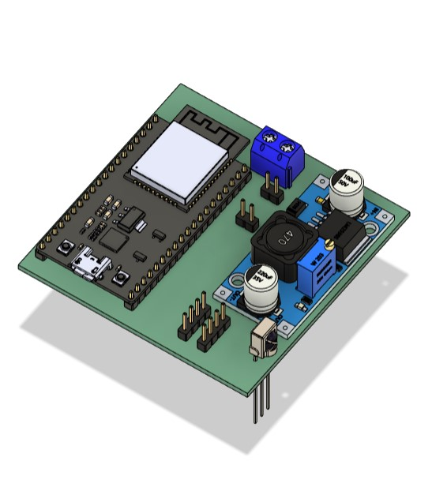

# 🧠 Smart Curtain Robot

**Smart Curtain Robot** is an automated curtain system powered by **ESP32** and an **infrared receiver (VS1838B)**.  
It drives **two stepper motors (28BYJ-48 + ULN2003)** that rotate in opposite directions to move a sliding mechanism — opening or closing the curtain.  
The system is optimized for **battery efficiency** using **Deep Sleep mode**, and supports **dual firmware frameworks (Arduino & ESP-IDF)**.

---
## 🖼️ Project Images

### 🔹 3D Model


### 🔹 PCB Design



## 🧩 Project Architecture

### Folder structure

- `Smart_Curtain_Robot/`
  - `Firmware/`
    - `Arduino_Framework_Code/` — ESP32 (Arduino core) source
    - `ESP_IDF_Framework_Code/` — ESP32 (ESP-IDF) source
  - `Hardware/`
    - `3d-models/`
      - `SCR_3D_Models_File_Final_.step`
    - `Fritzing_Sketch/`
      - `Sketch.fzz`
      - `lib/`
        - `28BYJ-48_Stepper_Motor-improved.fzpz`
        - `3x_18650_Battery.fzpz`
        - `Fydun_UNL2003_stepper_driver.fzpz`
        - `MH-ET_Live_Minikit_for_ESP32-fixed.fzpz`
        - `Voltage_Regulator_3.3V_LM1117.fzpz`
        - `vs1838b.fzpz`
  - `images/`
    - `3D_model.jpg`
    - `pcb.jpg`


---

## 🔧 Hardware Components

| Component | Function |
|------------|-----------|
| **ESP32 D1 Mini** | Central controller – handles IR decoding and motor control |
| **VS1838B IR Receiver** | Receives IR remote commands (NEC protocol) |
| **2 × 28BYJ-48 Stepper Motors + ULN2003 Drivers** | Open/close curtain by rotating in opposite directions |
| **3 × 18650 Battery Pack** | Power supply for the system |
| **LM1117 (3.3V Voltage Regulator)** | Provides stable voltage for ESP32 |
| **Optional sensors** | Limit switch, light sensor, etc. |

---

## 🧠 Working Principle

- The **IR receiver (VS1838B)** continuously listens for commands while ESP32 is awake.
- ESP32 wakes up from **Deep Sleep** when an IR signal (LOW pulse) is detected on **GPIO 27**.
- Depending on the received **NEC command code**, ESP32 performs:
  - `0xFF0040` → Move **Forward** (Open Curtain)
  - `0xFF0044` → Move **Backward** (Close Curtain)
  - `0xFF0043` → **Stop**
- Both stepper motors rotate in opposite directions to pull the curtain slider.
- After **60 seconds of inactivity**, ESP32 automatically stores the last state and enters **Deep Sleep** again.

---

## 🔋 Power-Saving Design

- In **Deep Sleep**, only the IR receiver module stays powered.  
- The ESP32 consumes only a few microamps, extending the battery life of the **3×18650 pack**.
- Upon wake-up, the system resumes from the last saved state using NVS/EEPROM.

---

## 🧱 Firmware Overview

### 📘 Arduino Framework
- Folder: `/Firmware/Arduino_Framework_Code`
- Key libraries:
  - `IRremote.h` — NEC signal decoding
  - `Stepper.h` — Stepper motor control
  - `EEPROM.h` — Save last motor state
- Deep Sleep configured via:
  ```cpp
  esp_sleep_enable_ext0_wakeup(GPIO_NUM_27, 0);
  esp_deep_sleep_start();
